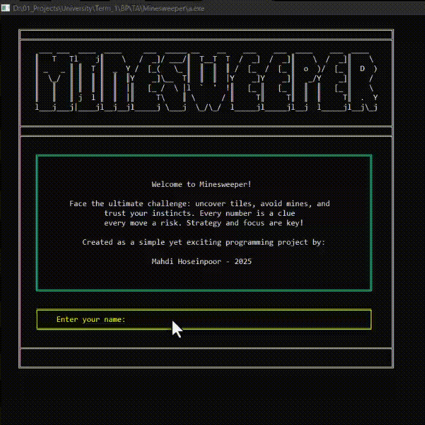

# Introduction
MineSweeper is a timeless puzzle game first popularized by Microsoft in the 1990s. For my mid-term assignment in the Basic Programming course, I decided to create a simplified yet fully functional version of this classic game using C++.

# Preview



# Project Overview

## Purpose of the Project
The aim was to develop a lightweight MineSweeper game entirely in C++, utilizing ASCII and Unicode characters for the game interface. The focus was on simplicity, speed, and faithful gameplay while incorporating small enhancements to make it more engaging.

## Goals
- Reproduce the core mechanics of MineSweeper.
- Maintain fast and responsive performance.
- Add creative features without relying on complex data structures.
- Meet all the evaluation criteria, such as adding extra functionalities and implementing a leaderboard.

## Extra Features Included
- Adjustable difficulty levels
- Scoring system with a persistent leaderboard

# Implementation Details

## Game Mechanics
At the start of the game, a grid is generated according to the chosen difficulty. The first cell selected by the player is guaranteed to be safe, and bombs are placed accordingly. Players can move through the grid, marking cells as either cleared or flagged. The game ends if a bomb is revealed by mistake.

## User Interface
The game's user interface is designed with clarity and aesthetics in mind.  
- The grid is easy to read and navigate.  
- Flags, bombs, and numbers are clearly distinguishable.  
- Color themes enhance the visual appeal without compromising readability.  
This makes the gameplay intuitive and enjoyable for both beginners and experienced players.

## Data Storage
Scores and leaderboard information are stored in a `scoreBoard.txt` file. The program reads and writes this file to update rankings and maintain a record of player performance.

# How to Compile

1. Make sure a C++ compiler is installed. Options include GCC on Linux or MinGW on Windows.
2. Open a terminal or command prompt and navigate to the folder containing the source code.
3. Compile the program using:

  ```bash
   g++ main.cpp -o minesweeper.exe
```
   Replace `g++` with the appropriate compiler command if you are using a different compiler.
   After successful compilation, an executable will be generated:
    `Windows: minesweeper.exe`
    `Linux: minesweeper`
  
4. Run the game with:
 ```bash
./minesweeper      # Linux
minesweeper.exe    # Windows
   ```
